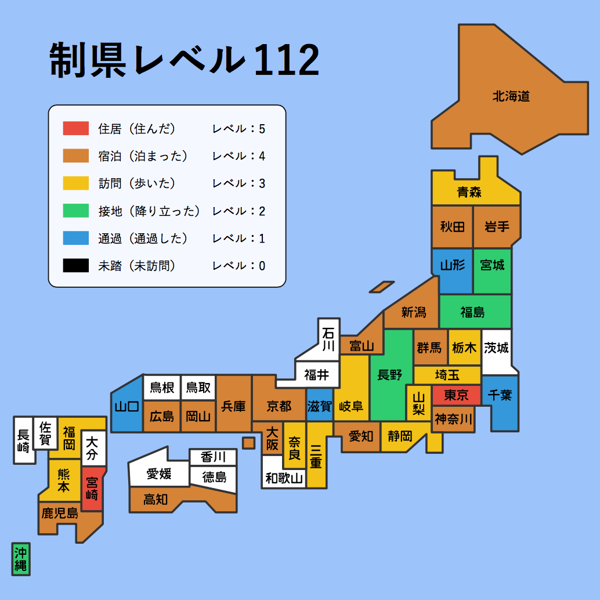

# JapanEx 制縣傳說

## Purpose

Let travelors to Japan have a funny way to transform their traveling experience into a map with numeric levels. Click on a county to score, and share with friends by saving map as an image. Have fun :)

## How does it do?

By making the map with svg, we can specify an ID tag for each county layer, then such ID can be used in Javascript. Score is divided into 6 levels for each area:

- Level 0: Never been there
- Level 1: Passed there
- Level 2: Alighted there

  Ex. taking a rest at SA, or transfer

- Level 3: Visited there

  Ex. round trip within one day, or just visited few spots without overnight

- Level 4: Stayed there

  Ex. Stayed more than 1 day at a place

- Level 5: Lived there

  Ex. typically for work or living for more than half year

## Revisions

##### 2018.09.18

Added English UI language.

##### 2018.05.30

Fixed the name and area bug for some counties.

## Other Countries Versions

1. [Taiwan](https://travel.tonypai.com.tw/)
2. [Hong Kong](http://www.thelittleprince.hk/hongkong/)
